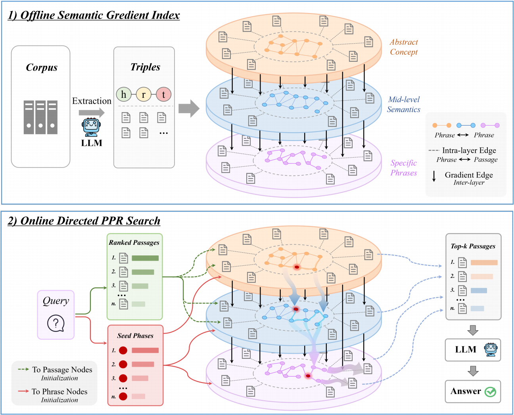

# SemFlowRAG: Directed Semantic Flow from Abstraction to Evidence for Complex Reasoning


## Repository Layout

All runnable code in this repository is under `Innovation/`.

- `main.py`: main reproduction entry point. It reads `reproduce/dataset/{dataset}.json` and `{dataset}_corpus.json`, then runs indexing, retrieval, QA, and evaluation.
- `main_dpr.py`: DPR baseline using `StandardRAG`, without OpenIE graph construction.
- `main_azure.py`: Azure OpenAI / embedding endpoint entry point.
- `demo.py`, `demo_openai.py`, `demo_local.py`, `demo_azure.py`, `demo_bedrock.py`: small quick-start demos.
- `tests_openai.py`, `tests_local.py`, `tests_azure.py`: regression tests for indexing, graph loading, document updates, and deletion.
- `src/semflowrag/SemFlowRAG.py`: main class implementing `index`, `retrieve`, `rag_qa`, graph construction, PPR, and directed PPR.
- `src/semflowrag/StandardRAG.py`: standard passage-embedding RAG baseline.
- `src/semflowrag/embedding_store.py`: storage for chunk, entity, and fact embeddings.
- `src/semflowrag/information_extraction/`: OpenIE extraction, including online OpenAI-compatible calls and vLLM offline batch mode.
- `src/semflowrag/embedding_model/`: embedding model adapters, including NV-Embed-v2, GritLM, Contriever, and OpenAI-compatible embeddings.
- `src/semflowrag/llm/`: LLM adapters for OpenAI-compatible APIs, vLLM, and other local/cloud backends.
- `src/semflowrag/prompts/`: prompt templates for NER, triple extraction, fact filtering, and QA.
- `src/semflowrag/evaluation/`: retrieval recall and QA EM/F1 metrics.
- `reproduce/dataset/`: reproduction datasets, including `sample`, `musique`, `hotpotqa`, `2wikimultihopqa`, `popqa`, `nq_rear`, `lveval`, and `narrativeqa_dev_10_doc`.

## Method Pipeline

<p align="center">
  
</p>

Offline indexing:

1. Load the corpus and format each document as `title + "\n" + text`.
2. Build a dense embedding store for passages.
3. Run OpenIE to extract named entities and RDF-style factual triples.
4. Build embedding stores for entities and facts.
5. Construct graph edges from entity-entity facts, passage-entity links, and entity similarity links.
6. If `enable_directed_ppr=True`, precompute entity abstractness, normalization statistics, self-loops, and retrieval caches.
7. Save graph, embeddings, and OpenIE results under `outputs/` for reuse.

Online retrieval and QA:

1. Encode the query and retrieve candidate facts from the fact embedding store.
2. Run the DSPy fact filter to keep query-relevant bridge facts and answer-bearing facts.
3. Map retained facts to entity seeds and mix them with DPR passage seeds to build the PPR reset distribution.
4. If directed PPR is enabled, rewrite entity-edge weights for the current query using query relevance and abstractness difference.
5. Run PPR over the graph and rank passage nodes by their converged scores.
6. Feed the top-k passages to the LLM for answer generation and compute QA / retrieval metrics when gold labels are available.

If fact filtering returns no relevant candidate facts, the system falls back to dense passage retrieval instead of propagating from unreliable graph seeds.

## Installation

Install from this directory in editable mode so scripts use the local implementation:

```sh
cd /mnt/phwfile/qinhouyuan/SemFlowRAG/Innovation

conda create -n semflowrag python=3.10
conda activate semflowrag

pip install -e .
```

Common environment variables:

```sh
export CUDA_VISIBLE_DEVICES=0,1,2,3
export HF_HOME=<your_huggingface_home>
export OPENAI_API_KEY=<your_openai_api_key>
```

For local vLLM serving, also set:

```sh
export VLLM_WORKER_MULTIPROC_METHOD=spawn
```

## Quick Start

Use the small `sample` dataset to verify the environment:

```sh
cd /mnt/phwfile/qinhouyuan/SemFlowRAG/Innovation
conda activate semflowrag

dataset=sample
python main.py \
  --dataset $dataset \
  --llm_base_url https://api.openai.com/v1 \
  --llm_name gpt-4o-mini \
  --embedding_name nvidia/NV-Embed-v2
```

`main.py` automatically reads:

- Corpus: `reproduce/dataset/${dataset}_corpus.json`
- Queries and answers: `reproduce/dataset/${dataset}.json`
- Fact-filter prompt: `src/semflowrag/prompts/dspy_prompts/filter_llama3.3-70B-Instruct.json`
- Outputs: `outputs/${dataset}/`

Useful arguments:

- `--force_index_from_scratch true`: ignore existing embedding and graph caches and rebuild the index.
- `--force_openie_from_scratch true`: ignore existing OpenIE caches and rerun entity/triple extraction.
- `--openie_mode online`: run OpenIE through an OpenAI-compatible API.
- `--openie_mode offline`: run OpenIE with vLLM offline batch mode for larger indexing jobs.
- `--save_dir outputs`: default value; expanded by `main.py` to `outputs/{dataset}`.

## Enabling Directed Semantic Flow

The directed semantic-flow implementation is controlled by `BaseConfig.enable_directed_ppr`. It is currently `False` by default, so running `main.py` without modification uses the SemFlowRAG 2 base graph retrieval path.

To run the main method from the EMNLP paper, explicitly enable it in the `BaseConfig(...)` construction inside `main.py`:

```python
config = BaseConfig(
    # ... existing args ...
    enable_directed_ppr=True,
    ppr_down_direction_prob=0.9,
    ppr_up_direction_prob=0.1,
    ppr_score_lambda_rel=1.0,
    ppr_score_lambda_div=1.0,
)
```

When enabled, `BaseConfig.__post_init__` forces `is_directed_graph=True`. During indexing, the system precomputes entity abstractness and related caches. During retrieval, each query calls `build_directed_edge_weights(...)` to rewrite edge weights using query relevance and abstractness difference.

Related ablation and analysis options:

- `ppr_skip_direction_control=True`: keep the edge scoring formula, but disable the 9:1 directional budget split.
- `ppr_score_lambda_rel=0` or adjust `ppr_score_const_base`: study retrieval without query relevance.
- `ppr_score_lambda_div=0`: study retrieval without the abstractness-difference penalty.
- `dump_retrieval_artifacts=True`: write query-level seeds and retrieved passages to `retrieval_artifacts.jsonl`.
- `dump_entity_black_hole=True`: write top entity nodes, abstractness, and query similarity to `entity_black_hole_artifacts.jsonl`.
- `ppr_experiment_mode="entity_only_innovation"` or `"entity_only_vanilla"`: run side-channel entity-only PPR comparisons without changing the main retrieval output.

## Local vLLM Usage

Start an OpenAI-compatible vLLM server:

```sh
export CUDA_VISIBLE_DEVICES=0,1
export VLLM_WORKER_MULTIPROC_METHOD=spawn
export HF_HOME=<your_huggingface_home>

conda activate semflowrag
vllm serve meta-llama/Llama-3.3-70B-Instruct \
  --tensor-parallel-size 2 \
  --max_model_len 4096 \
  --gpu-memory-utilization 0.95
```

In another terminal, run the experiment:

```sh
cd /mnt/phwfile/qinhouyuan/SemFlowRAG/Innovation
conda activate semflowrag

export CUDA_VISIBLE_DEVICES=2,3
dataset=sample

python main.py \
  --dataset $dataset \
  --llm_base_url http://localhost:8000/v1 \
  --llm_name meta-llama/Llama-3.3-70B-Instruct \
  --embedding_name nvidia/NV-Embed-v2
```

If GPU memory is insufficient, reduce `--max_model_len`, reduce `--gpu-memory-utilization`, or reserve separate GPUs for the embedding model.

## OpenIE Offline Batch Mode

For larger corpora, online OpenIE can be slow. You can first generate OpenIE caches with vLLM offline batch mode:

```sh
cd /mnt/phwfile/qinhouyuan/SemFlowRAG/Innovation
conda activate semflowrag

export CUDA_VISIBLE_DEVICES=0,1,2,3
export VLLM_WORKER_MULTIPROC_METHOD=spawn
export HF_HOME=<your_huggingface_home>
export OPENAI_API_KEY=""

dataset=sample
python main.py \
  --dataset $dataset \
  --llm_name meta-llama/Llama-3.3-70B-Instruct \
  --embedding_name nvidia/NV-Embed-v2 \
  --openie_mode offline
```

The offline step writes OpenIE results. Then start a vLLM online server and rerun `main.py` with the same `dataset`, `llm_name`, and `embedding_name`; the program will reuse the OpenIE cache and continue with graph construction, retrieval, and QA.

## Custom Datasets

Place custom data under `reproduce/dataset/` and keep paired names:

- `{name}_corpus.json`: retrieval corpus.
- `{name}.json`: queries, answers, and optional gold evidence.

Corpus format:

```json
[
  {
    "title": "FIRST PASSAGE TITLE",
    "text": "FIRST PASSAGE TEXT",
    "idx": 0
  },
  {
    "title": "SECOND PASSAGE TITLE",
    "text": "SECOND PASSAGE TEXT",
    "idx": 1
  }
]
```

Query format:

```json
[
  {
    "id": "sample/question_1.json",
    "question": "QUESTION",
    "answer": ["ANSWER"],
    "paragraphs": [
      {
        "title": "SUPPORTING PASSAGE TITLE",
        "text": "SUPPORTING PASSAGE TEXT",
        "is_supporting": true,
        "idx": 0
      }
    ]
  }
]
```

`main.py` supports common evidence schemas such as `supporting_facts`, `contexts`, and `paragraphs`. If no gold evidence is available, QA can still run, but retrieval recall cannot be evaluated.

## Outputs and Caches

The default output directory is `outputs/{dataset}`. Common files include:

- `openie_results_ner_{llm}.json`: OpenIE extraction cache.
- `{llm_name}_{embedding_name}/chunk_embeddings/`: passage embedding store.
- `{llm_name}_{embedding_name}/entity_embeddings/`: entity embedding store.
- `{llm_name}_{embedding_name}/fact_embeddings/`: fact embedding store.
- `{llm_name}_{embedding_name}/graph.pickle`: constructed graph.
- `retrieval_artifacts.jsonl`: generated when `dump_retrieval_artifacts=True`.
- `entity_black_hole_artifacts.jsonl`: generated when `dump_entity_black_hole=True`.

To rerun an experiment from scratch, remove both the OpenIE cache and the model-specific working directory, for example:

```sh
rm outputs/sample/openie_results_ner_meta-llama_Llama-3.3-70B-Instruct.json
rm -rf outputs/sample/meta-llama_Llama-3.3-70B-Instruct_nvidia_NV-Embed-v2
```

Actual directory names are derived from `llm_name` and `embedding_name` by replacing `/` with `_`; check the runtime logs if unsure.

## Tests

OpenAI-compatible test:

```sh
cd /mnt/phwfile/qinhouyuan/SemFlowRAG/Innovation
conda activate semflowrag
export OPENAI_API_KEY=<your_openai_api_key>

python tests_openai.py
```

Local vLLM test:

```sh
cd /mnt/phwfile/qinhouyuan/SemFlowRAG/Innovation
conda activate semflowrag

export CUDA_VISIBLE_DEVICES=1
python tests_local.py
```

## Experimental Findings

The paper evaluates SemFlowRAG on NaturalQuestions, PopQA, MuSiQue, 2WikiMultiHopQA, HotpotQA, LV-Eval, and NarrativeQA. The main findings are:

- Directed semantic flow retrieves more complete evidence chains on multi-hop QA and reduces semantic drift from high-abstractness hub nodes.
- Compared with HippoRAG 2, GraphRAG, RAPTOR, LightRAG, BM25, Contriever, GTR, and NV-Embed-v2, SemFlowRAG achieves stronger average QA F1 and Recall@5.
- Ablations show that direction control, query relevance, and the abstractness penalty all contribute to performance.

See the paper PDF in the repository root for full experimental settings, numeric results, ablations, and the case study.

## Notes

- `enable_directed_ppr` is not currently exposed as a CLI argument. To reproduce the main paper method, set it explicitly in `BaseConfig`.
- `max_qa_steps` exists in the config, but the current main QA path reads top-k evidence once and generates the answer in a single call; it is not a default multi-step IRCoT loop.
- OpenIE quality directly affects graph quality. Missing entities, incorrect triples, or noisy corpora can degrade abstractness estimation and retrieval.
- Directed semantic flow assumes that most complex questions benefit from moving from abstract concepts toward concrete evidence. For tasks requiring lateral association or bottom-up inference, tune the direction ratio, reset probability, or ablation flags.
- Large LLMs and embedding models require substantial GPU memory. Start with the `sample` dataset before scaling to full benchmarks.
